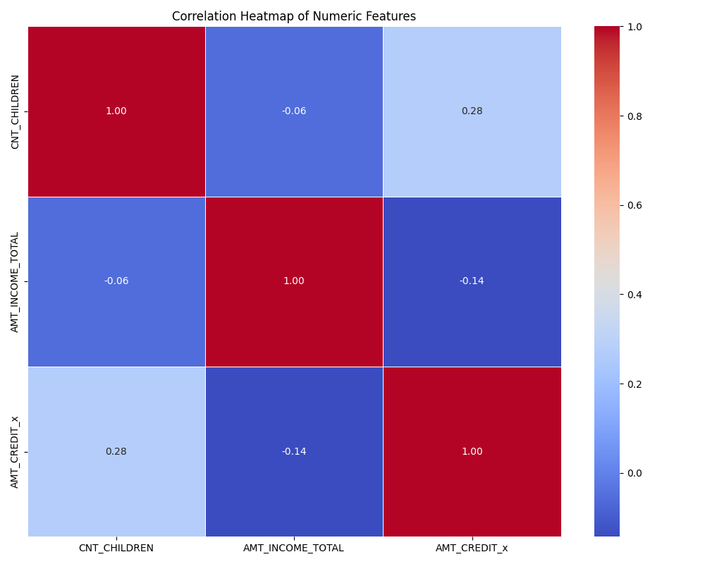
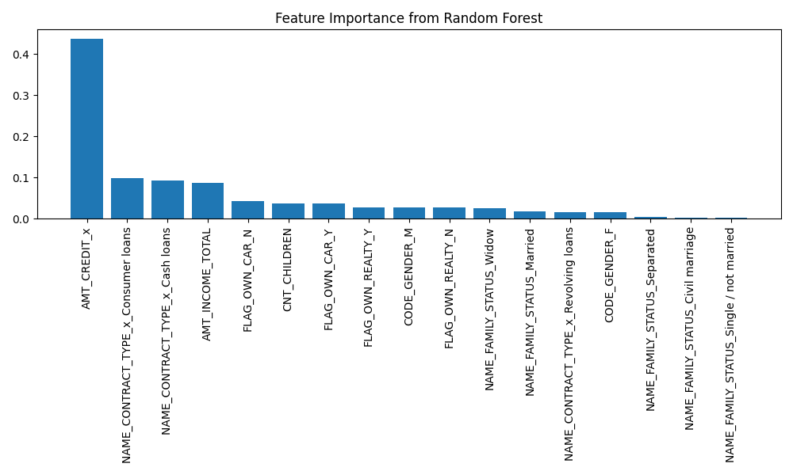
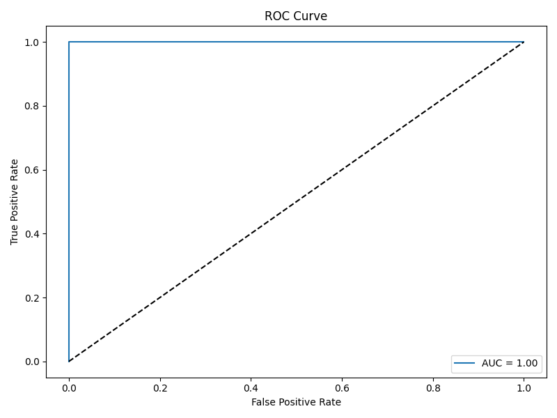
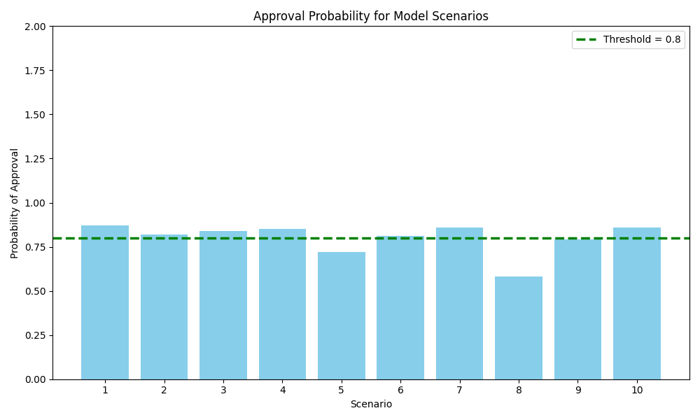

#### Ruiz-Capstone- Exploring Loan Approvals 

# A Model for Bank Loan Approval Analysis and Predictions

## Introuction
Banks have to make decisions everyday regarding to approve a customers loan or deny a loan. But how is this done? What are the main factors involved that decides who gets approved while others denied? I was in banking many years and hope to explore the answers with this project with the interesting analysis involved. The authors from 

## Abstract

This project will work with data from a csv file, that will be cleaned and analyzed. A machine learning pipeline to predict loan approval decisions using applicant attributes will be developed. Trained, tested,and deployed two models, Random Forest and Logistic Regression, and evaluated their performance. Scenarios with random features were used for loan approval predictions.

## {Goals of this Research} 
The goal will be to analyze csv data for bank customers and develop a model to predict loan approvals.

## Dataset from:
https://www.kaggle.com/code/gauravduttakiit/risk-analytics-in-banking-financial-services-1/input 

## Project Steps: 1. select topic, 2. select data set, 3. clean data set, 4. convert or transform data if needed, 5. train and develop a model, evaluate the model, Update and Adjust as needed.

### Requirements:
matplotlib==3.8.0
numpy==1.26.2
pandas==2.1.3
scikit-learn==1.3.0
seaborn==0.13.0
notebook==7.0.6

## Acitvate Virutal Environment
py -m venv .venv
.venv\Scripts\Activate
py -m pip install -r requirements.txt

## Limitations & Future Work
Limited feature included such as missing credit history, employment data. If more time avalable would have included.
Pedictions thresholds at 80% may not be a good fit for every banks use.

### Section 1. Load and Explore the Data
- 1.1 Load the dataset and display the first 10 rows.
- 1.2 Check for missing values and display summary statistics.
- removed columns and labels not needed resulting in data_merged.csv

### Section 2. Feature Selection and Justification
- 2.1 Choose two input features for predicting the target.
- Linear Regression eliminated, did not show strong correlations of features.

### Section 3. Train a  Model and Process for Exploratory Analysis
loan _model_workflow.ipynb
model.py

Random Forest Selected
-RandomForestClassifier(random_state=42)
-Features were encoded using one-hot encoding, and the target was label-encoded.
-Evalluated using classification report, confusion matrix, and feature importance plot

Logistic Regression Selected
-Explored coefficients for each feature.
-Trained using LogisticRegression(max_iter=1000).
-Vvaluated using F1-score, precision, recall, and ROC AUC score.

Train-Test Split
-Data was split into 80% training and 20% testing
-Passed through the Model
-Probabilities for loan approval were calculated and set
 at 80 percent threshold
-Results were exported to a text file

## Methods Used

1 .Proceess the data-Describe your data: source, number of records, key features, and filter data set down to what needed.
2 . Exploratory analysis-correlation heatmap, linear regression, Logistic Regression, 
3. Trained Logistic Regression and Random Forest classifiers
4. Evaluated model performance (accuracy, ROC AUC, F1 scores)
5. Scenario testing with sample applicant info
6. Feature importance analysis

## Results
| Model               | Accuracy | ROC AUC | F1 (Approved) |
|--------------------|----------|---------|----------------|
| Logistic Regression| 91%      | 1.00    | 0.80           |
| Random Forest      | ~86%     | —       | —              |

R‑squared values to show weak linear relationships from regression analysis.

Amount of Credit showed the most significant feature.  

Logistic Regression: 91% accuracy, ROC AUC = 1.00

Random Forest: ~86% accuracy

## Visualizations

### Heatmap
  
*Exploring correlations between features, including number of children.

### Feature Importance
  
Top features influencing loan approval decisions using Random Forest.

### ROC Curve
  
ROC curve for logistic regression with AUC = 1.00.

### Scenario Approval Probabilities
  
*Simulated approval probabilities for different applicant scenarios.*

## Conclusions
No strong linear correlation exists between income and approval or children. However, combining multiple features in machine learning models of Random Forest Classifier and Logistic Regression led to accurate predictions on sample scenario predictions.

  

